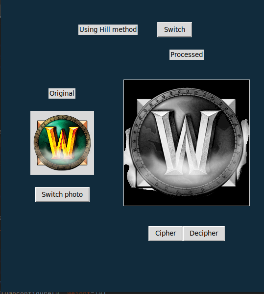
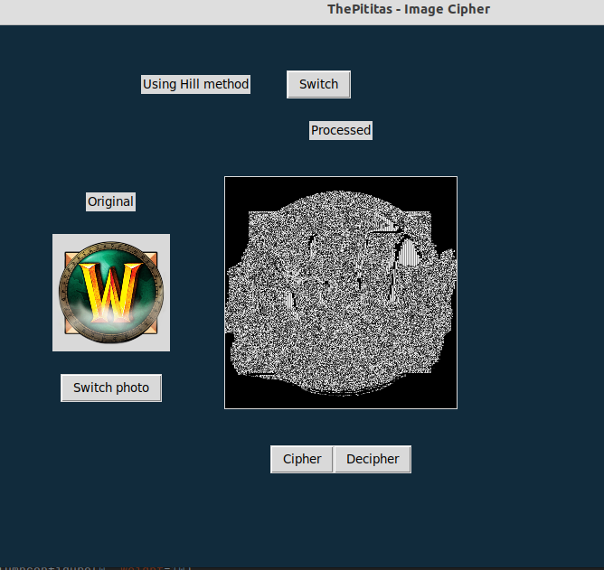
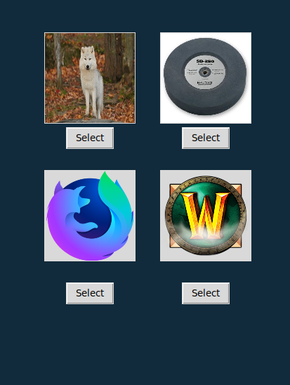

# ThePititas

This is a program to cipher and decipher images.
# Members

* Daniel Pablo Espinoza Escalera
* Luiggy Mamani Condori
* Gabriel Santiago Concha Saavedra
* Eduard Jhon Herrera Sánchez
* Gaston Gutierrez Condori

# Project Dependencies

* Open cv
* Numpy
* tkinter

# Project Images
 
 
 